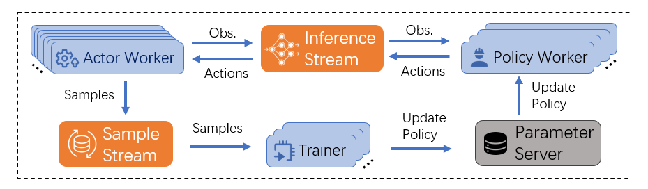

# System Components: Overview (Local Version)

In this section, basic system components will be introduced to give users a first impression of how the system works. 

## Workers

Workers are stateful computational components that follows a pre-defined workflow. In distributed version of the system, upon system starts, workers will be launched as RPC servers that receive requests from a centralized controller. The centralized controller calls remote methods in workers to control their life cycle. In local version, this procedure is simplified into a python `multiprocessing` implementation. `apps/local.py` launches all workers and manages them as `multiprocessing.Process`.

In our original system, there are 3 types of workers: [Actor Workers](02_actor_worker.md), [Policy Workers](03_policy_worker.md) and [Trainer Workers](04_trainer_worker.md), corresponding to simulation, inference and training tasks in RL. They are connected to each others by data streams (Inference Stream and Sample Stream). The relationship between these components is shown as follows: 

  

Users are allowed to implement their own workers to support self-designed RL algorithms. General APIs for workers are provided by a base class `worker_base.Worker`. See [Worker Base](01_worker_base.md) for detail.

## Data Streams
<!-- After implementing shared memory data streams, maybe independent data stream doc to introduce detail -->

Data streams are components that deals with communication between workers. In our original RL system design, there are two types of data streams: Inference Stream, which exchanges observations and actions between actor workers and policy workers; Sample Stream, which sends training samples from actor workers to trainer workers. In distributed version, data streams are implemented in ZMQ (https://zeromq.org/), while in local version, data streams are implemented with `multiprocessing.Queue`. 

### Inference Stream 

Inference streams gather/batch inference requests from actor workers, send them to policy workers, and receive responses from policy workers to reply actor workers. Inference stream is duplex. _Inference Clients_ and _Inference Servers_ of an inference stream could be created in endpoint workers as handles to receive and send data.

- _Inference Client_ is responsible for gathering/batching requests from actor workers and receiving responses from inference clients.
- _Inference Server_ is responsible for receiving requests and distributing inference results.
- Inline Inference: When using CPU as inference device, actor and policy workers reside in the same process. Inline inference stream avoids unnecessary communication in this situation.

- Distributed Inference stream is implemented in ZMQ (https://zeromq.org/).
  - Requests: PUSH-PULL pattern sockets.
  - Responses: PUB-SUB pattern sockets.
- Local Inference stream is implemented with `multiprocessing.Queue`.
  - Two queues, one for requests and one for responses.

See [Inference Stream](07_inference_stream.md) for detailed APIs and usage.

### Sample Stream

Sample streams receive and batch training samples from actor workers and send them to trainer workers. Sample Stream is simplex. _Sample Producers_ and _Sample Consumers_ of a sample stream could be created in endpoint workers as handles to receive and send data.

- _Sample Producer_ is responsible for batching samples and sending out samples.
- _Sample Consumer_ is responsible for consuming samples (into buffers).

- Sample are batches two times before consuming.
  - Upon sending, actors will batch the sample along the _time_ dimension.
  - Upon consuming, buffer will batch the sample along the _batch_ dimension.

- Distributed Sample Stream is implemented in ZMQ.
  - PUSH-PULL pattern sockets.
- Local Inference Stream is implemented with `multiprocessing.Queue`.
  - One queue for training sample.

See [Sample Stream](08_sample_stream.md) for detailed APIs and usage.

### Generality

Both sample streams and inference stream could be used in a more general way. To support communication between workers implemented by users, payload of data streams could be data other than inference requests, replys and training samples. From our observation, sample streams and inference streams are able to satisfy requirements for communications between any types of workers.

## Parameter Database

Parameter Database stores model parameters, and workers can push/get parameters via ParameterDBClient. 

- ParameterDB is currently implemented in file systems (NFS for distributed, local file system for local).
- Metadata query is supported via MongoDB (distributed).

See [Basic Utils](08_basic_utils.md) for further details.

## Name Resolving and Name Record Repositories

Workers exchange system level metadata via Name Resolving, including addresses, ports, peers, etc. Name record repositories are databases that stores system level metadata and provide supports for various data operations. Name Resolving is now mostly used in distributed version of the system. 

NameResolving is currently used in the following ways:
- Workers save their listen port to name resolve for controller.
- InferenceServer reveal their inbound address for clients.
- SampleConsumer reveal their inbound address for producers.
- Trainers reveal their identity so that they can find DDP peers.

Name record repositories implementations:
- MemoryNameRecordRepository (Local only. No inter-node communication.)
- NFSNameRecordRepository (Distributed, requires NFS support in cluster)
- RedisNameRecordRepository (Distributed, requires [redis](https://redis.io/docs/) support in cluster. Recommended.)

See [Basic Utils](09_basic_utils.md) for further details.

# Related References

- [Worker Base](01_worker_base.md)
- [Actor Worker](02_actor_worker.md)
- [Policy Worker](03_policy_worker.md)
- [Trainer Worker](04_trainer_worker.md)
- [Inference Stream](07_inference_stream.md)
- [Sample Stream](08_sample_stream.md)

# Related Files or Directories
- [system/api/inference_stream.py](../../src/rlsrl/system/api/inference_stream.py)
- [system/api/parameter_db.py](../../src/rlsrl/system/api/parameter_db.py)
- [system/api/sample_stream.py](../../src/rlsrl/system/api/sample_stream.py)
- [system/api/worker_base.py](../../src/rlsrl/system/api/worker_base.py)

# What's Next

- [Worker Base](01_worker_base.md)
